<div align="center">

# ⚡ Serverless Image Processing on Google Cloud

### A private, event-driven image pipeline built with Cloud Functions Gen2, Pub/Sub, Eventarc, Cloud Storage, and Terraform.

[](https://github.com/TheShivm/serverless-image-processing-gcp/actions/workflows/validate.yml)


**Upload an image. Get a resized copy. Receive an auditable completion event.**

[Explore the architecture](#architecture) · [Read the evidence story](#the-build-the-proof-and-the-clean-teardown) · [Deploy it](#deploy-your-own-pipeline) · [Run live verification](#prove-the-deployment-works) · [Read the runbooks](#documentation)

</div>

> [!IMPORTANT]
> This is an intentionally small, production-minded learning project—not a public upload API. Every workload entry point is authenticated, Terraform is the source of truth, and the verifier distinguishes a resized file from a truly completed end-to-end run.

---

## ✨ What happens when an image arrives?

An object finalized in the private input bucket starts a two-stage pipeline. The resize function writes a same-key output object, publishes a success message only after that write succeeds, and a second function emits a structured completion record to Cloud Logging.

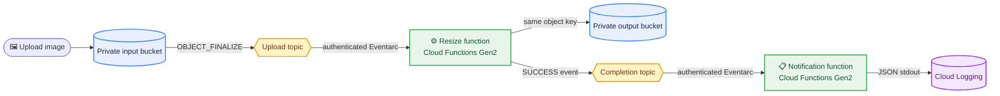
```mermaid
flowchart LR
    U([🖼️ Upload image]) --> I[(Private input bucket)]
    I -->|OBJECT_FINALIZE| P1{{Upload topic}}
    P1 -->|authenticated Eventarc| R[⚙️ Resize function<br/>Cloud Functions Gen2]
    R -->|same object key| O[(Private output bucket)]
    R -->|SUCCESS event| P2{{Completion topic}}
    P2 -->|authenticated Eventarc| N[📋 Notification function<br/>Cloud Functions Gen2]
    N -->|JSON stdout| L[(Cloud Logging)]

    classDef storage fill:#E8F0FE,stroke:#4285F4,color:#172554,stroke-width:2px;
    classDef topic fill:#FEF3C7,stroke:#F59E0B,color:#78350F,stroke-width:2px;
    classDef function fill:#E8F5E9,stroke:#34A853,color:#14532D,stroke-width:2px;
    classDef logging fill:#F3E8FF,stroke:#9333EA,color:#581C87,stroke-width:2px;
    class I,O storage;
    class P1,P2 topic;
    class R,N function;
    class L logging;
```

| In | Transformation | Out | Completion proof |
| --- | --- | --- | --- |
| `gs://input/photos/cat.jpg` | `max(1, width // 2)` × `max(1, height // 2)` | `gs://output/photos/cat.jpg` | `IMAGE_RESIZE_NOTIFICATION` log with `status: SUCCESS` |

The output keeps the original object name. A `1600 × 1000` JPEG becomes `800 × 500`; a `641 × 481` PNG becomes `320 × 240`; a `1 × 1` image remains `1 × 1`. This is a **dimension** transform, not a promise that the encoded file will be half the byte size.

### Architecture at a glance

**Image #1 — high-level design**

<p align="center">
  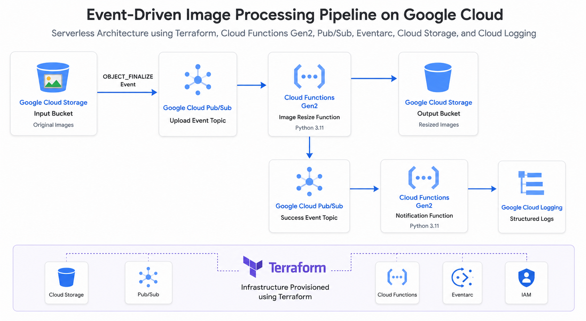
</p>

**Image #2 — low-level design**

<p align="center">
  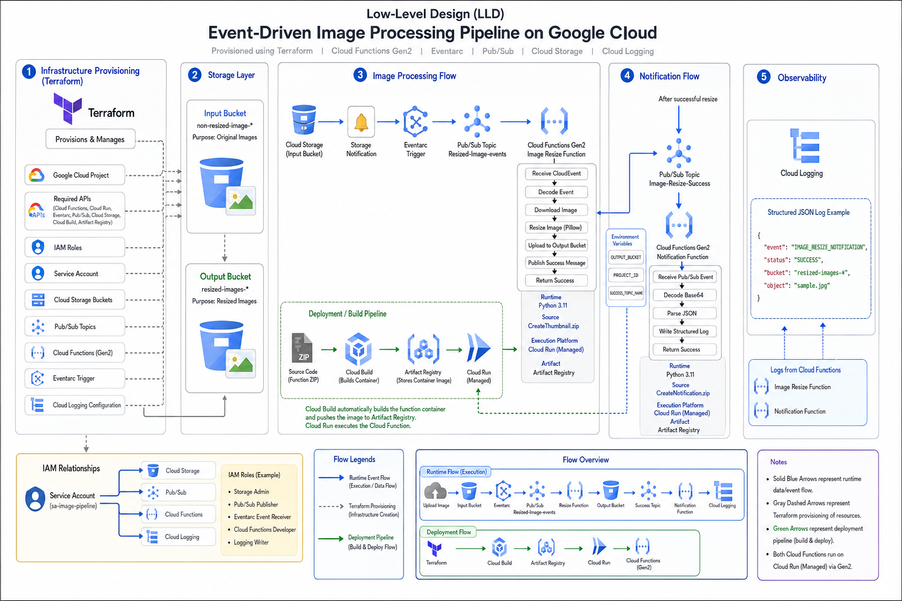
</p>

The diagrams are a visual explanation of the system boundaries. For repeatable deployment evidence, use the live verifier and its [sanitized verification report](docs/evidence/results/2026-09-30-live-verification.md).

---

## 📖 The build, the proof, and the clean teardown

> [!NOTE]
> This is a historical evidence story, not a claim that the demo is live today. The screenshots document a real deployment and verification run. Afterward, the pipeline was deliberately decommissioned. A final live inventory confirmed an empty Terraform state and the absence of both functions, Cloud Run services, Eventarc triggers, buckets, topics, service accounts, the generated source bucket, and the Cloud Functions Artifact Registry repository.

This project was never about producing a pretty architecture diagram and assuming the rest worked. The interesting part was the journey: take a tiny event-driven idea, make every boundary explicit, prove it with an actual object, try the unhappy path, and leave the cloud project clean when the experiment is over.

### Chapter 1 — establish a repeatable starting point

Before touching the cloud, the project was checked from the terminal: project context, Terraform, the Google provider, credentials, and the local toolchain. The goal was not a clever demo; it was a deployment that could be reasoned about and repeated.

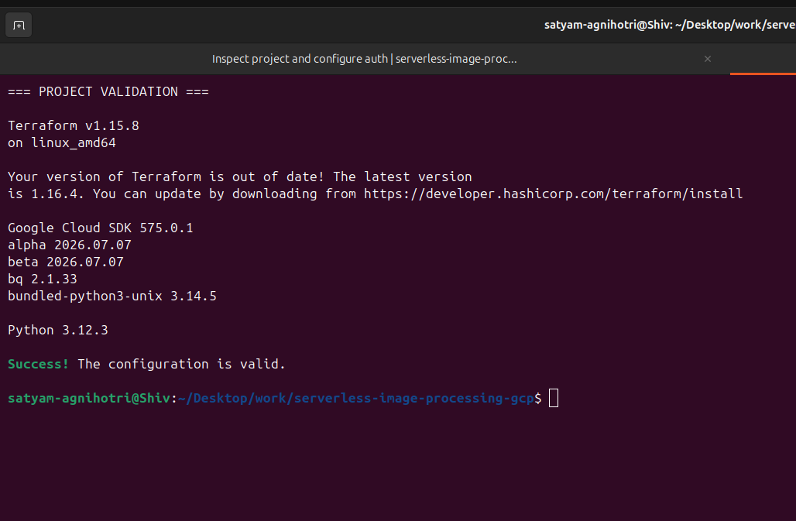

The next question was whether infrastructure code and cloud state told the same story. Terraform refreshed the declared resources and found no surprise changes before testing began.

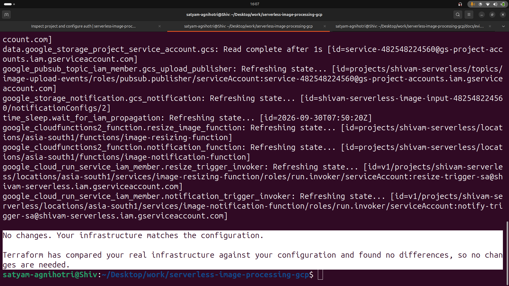

The deployed-state capture makes the important point visible: Terraform was checking a complete graph—storage, Pub/Sub, identities, Eventarc, functions, and IAM—not just a function zip uploaded somewhere.

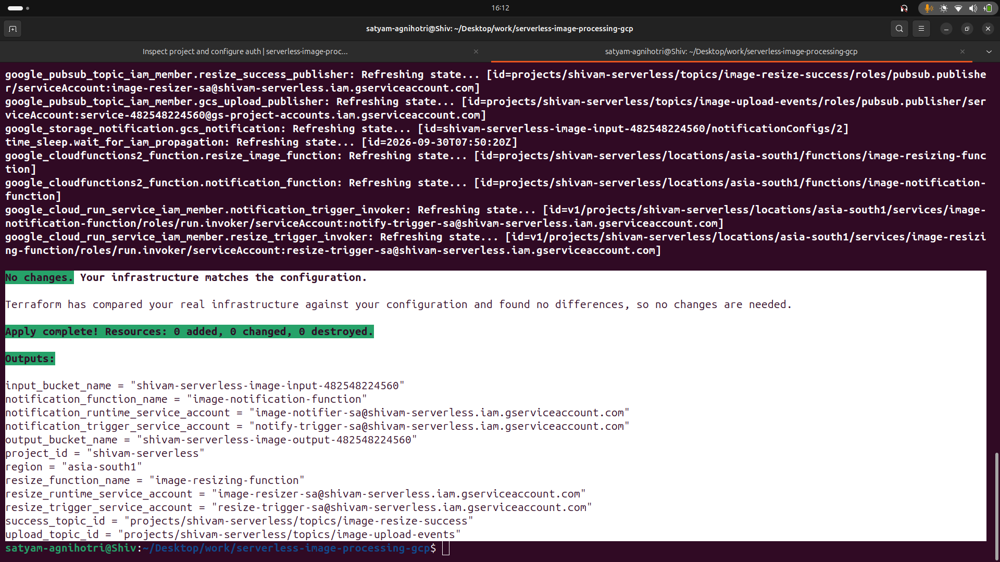

### Chapter 2 — make the route private and explicit

The implementation created two Cloud Run-backed Functions Gen2 services: one to resize images and one to record the completed work. Their value is not simply that they exist; it is that they are separate, internal-only services with a defined handoff between them.

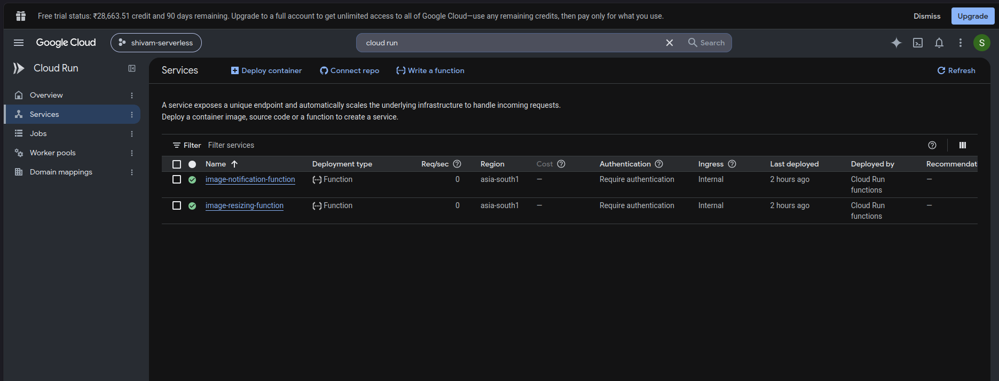

The first Eventarc route begins with the upload topic and invokes the resizer through the dedicated `resize-trigger-sa` identity.

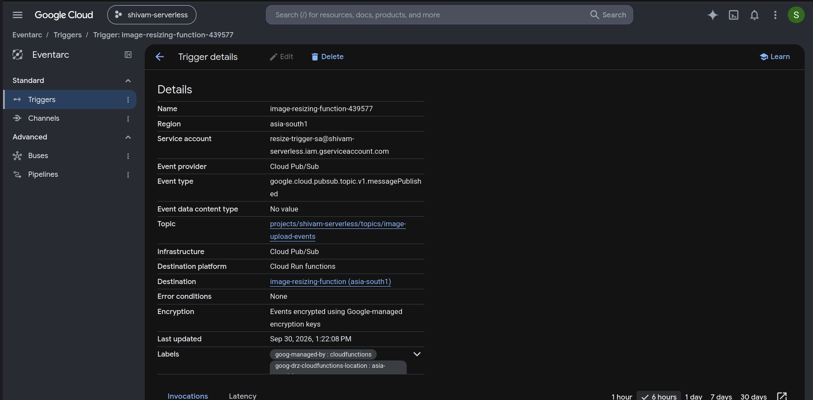

The second route carries a success message, not a Storage event. It invokes the notifier through its own `notify-trigger-sa` identity. That small separation makes the pipeline’s completion observable without giving the notifier access to images.

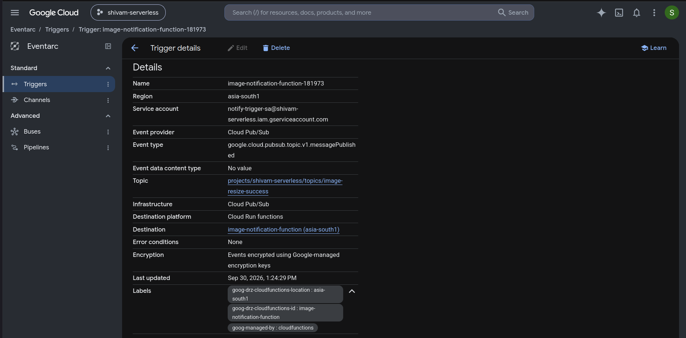

The input bucket’s configuration captures the project’s security posture in one place: uniform bucket-level access, public-access prevention, and storage notification routing. The runtime services remained private; public invocation was never used as a shortcut.

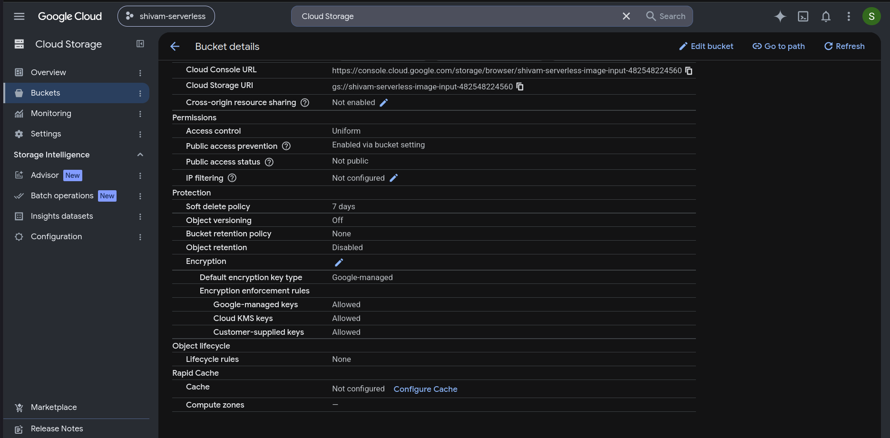

### Chapter 3 — follow one image through the system

With the route ready, the evidence uses one concrete object as the protagonist. The input object has a unique key, generation, and timestamp—enough information to distinguish this execution from every other upload.

<table>
  <tr>
    <td width="50%">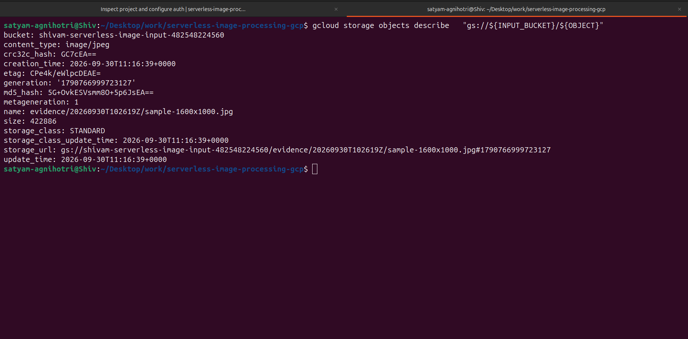</td>
    <td width="50%">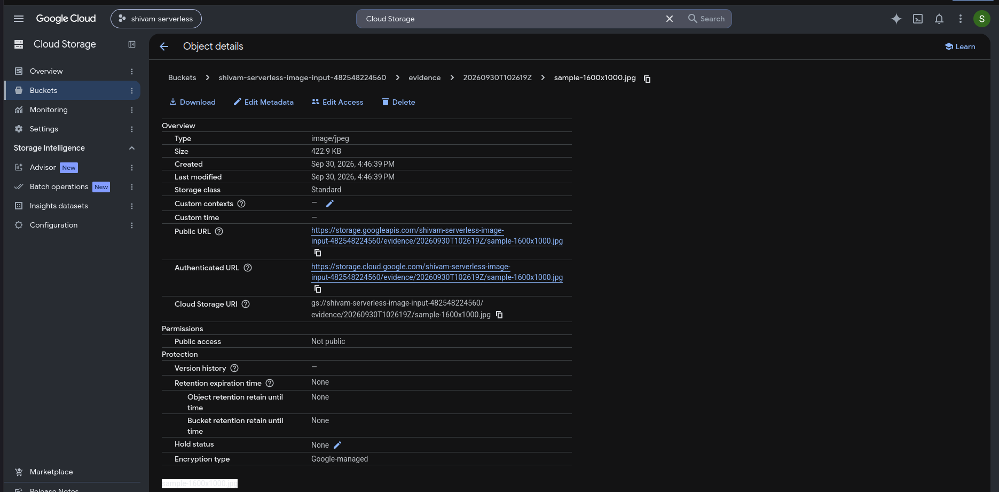</td>
  </tr>
  <tr>
    <td><em>CLI evidence records the object key and generation.</em></td>
    <td><em>Console evidence shows the same input object in Cloud Storage.</em></td>
  </tr>
</table>

The resize service then emits a structured execution trail. A single object key ties together the start, output upload, and successful completion records—the exact sequence that a screenshot of an output file alone cannot prove.

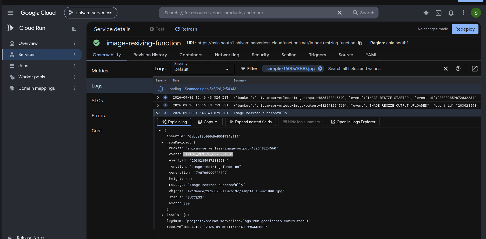

The output appears under the same key in the separate output bucket. Keeping the key stable makes correlation simple while keeping the original file separate from the transformed result.

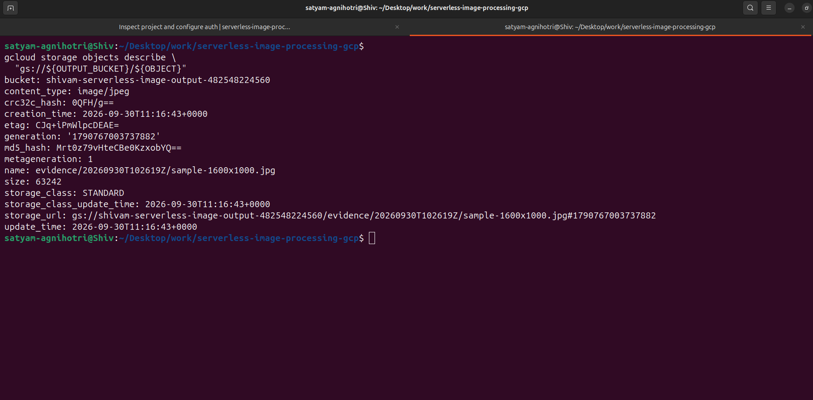

The transformation itself is measured, not inferred from file size. The demonstration captures the contract in its simplest form: a 1600 × 1000 source becomes an 800 × 500 result.

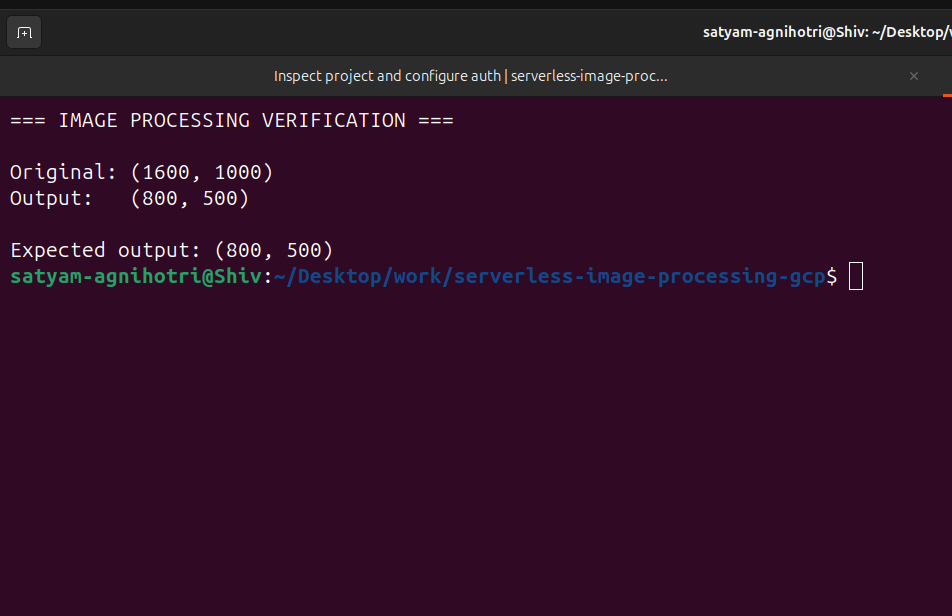

Only after the output write succeeds does the resizer publish its completion message. The notification function consumes that message and writes an `IMAGE_RESIZE_NOTIFICATION` JSON record, completing the pipeline’s second stage.

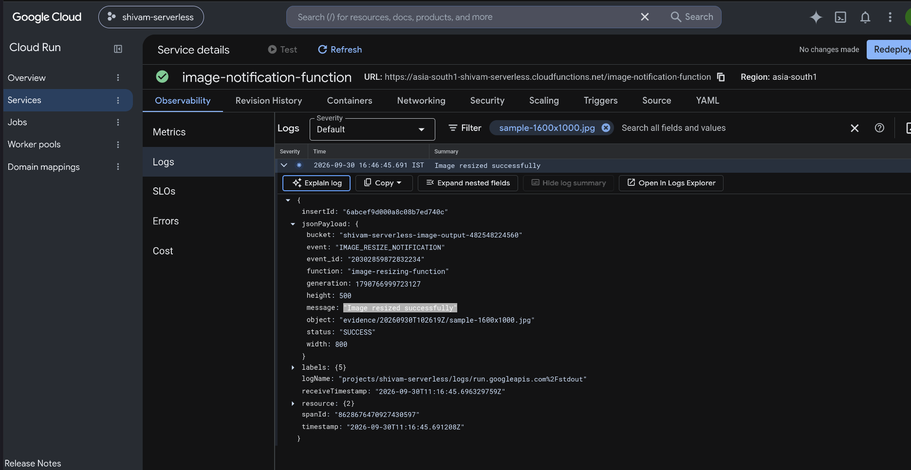

### Chapter 4 — prove the happy path and challenge it

The verifier gathers more than a green message. It records the project, run ID, object generations, output dimensions, input/output hashes, and notification observation for the same object. That gives the result enough context to audit later.

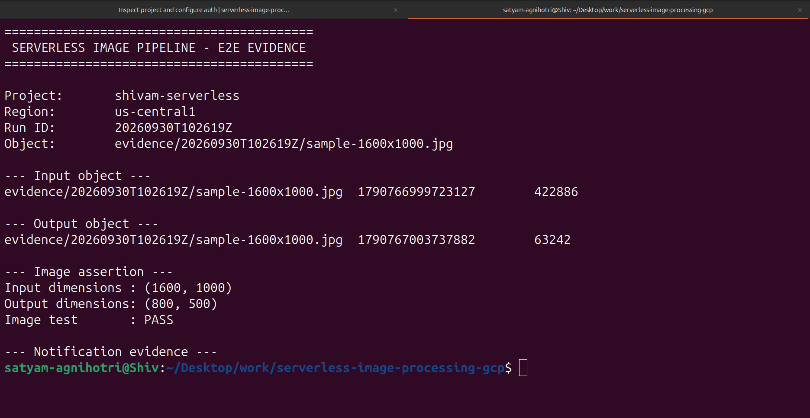

Then comes the important non-happy-path question: what happens when the upload is not an image? The resizer rejects invalid bytes. It must not create an output object, and it must not emit a downstream success notification.

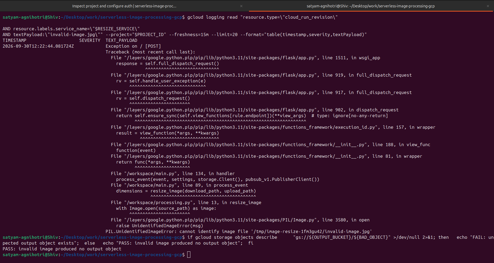

After the end-to-end checks, Terraform was run again. The final plan returned to a no-change result: the test exercised the workload without silently drifting the managed infrastructure.

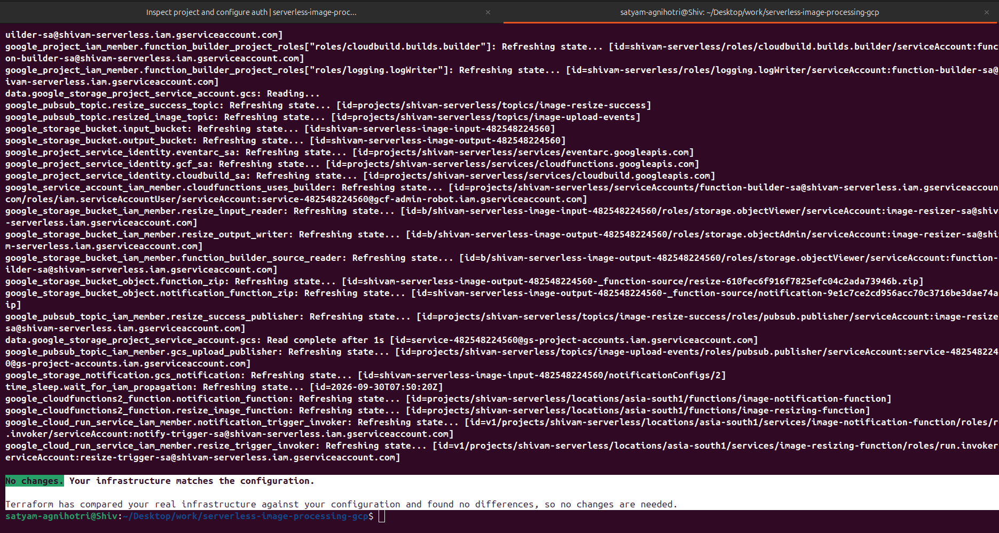

### Chapter 5 — leave no running workload behind

Good serverless hygiene is also knowing when to stop. The original cleanup evidence records the destroy operation and a narrow project inventory. A later final inventory repeated that check and confirmed that the active pipeline workload is gone.

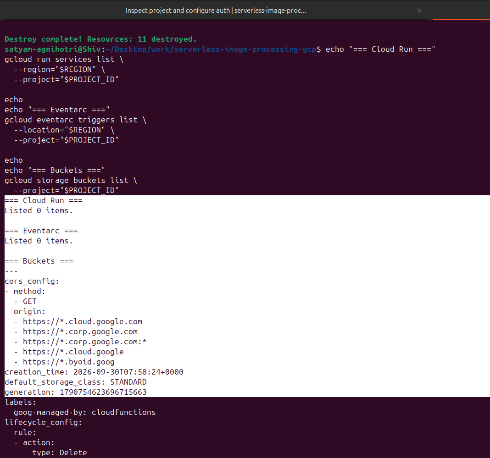

The lesson is intentionally modest: a serverless workflow is trustworthy when its input, routing, transformation, notification, failure behavior, drift check, and cleanup can all be shown—not just described. The configuration remains here as a reproducible blueprint; the verified cloud deployment is now decommissioned.

---

## 🧭 Architecture

### The moving parts

| Component | Responsibility | Why it exists |
| --- | --- | --- |
| **Input bucket** | Holds source images and emits `OBJECT_FINALIZE` notifications. | Keeps uploads independent from compute. |
| **Upload Pub/Sub topic** | Receives Cloud Storage notifications. | Decouples object finalization from processing. |
| **Resize function** | Validates the event, downloads the exact object generation when supplied, resizes with Pillow, uploads the result, then publishes completion. | Contains the single image-processing responsibility. |
| **Output bucket** | Stores resized images under the same object key. It also holds versioned source archives under `_function-source/`. | Separates original and transformed content. |
| **Completion Pub/Sub topic** | Carries the successful resize payload. | Establishes a clean boundary between processing and notification. |
| **Notification function** | Validates the completion payload and writes a single JSON log line. | Makes success queryable without adding a database or notification vendor. |
| **Cloud Logging** | Captures structured stdout from both functions. | Provides the final, searchable evidence of completion. |
| **Terraform** | Provisions APIs, buckets, topics, service accounts, IAM grants, notifications, and functions. | Makes the architecture repeatable and reviewable. |

### Event lifecycle, step by step

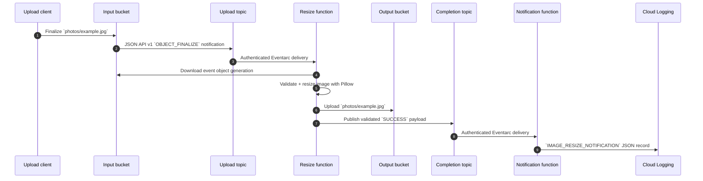
```mermaid
sequenceDiagram
    autonumber
    participant Client as Upload client
    participant Input as Input bucket
    participant Upload as Upload topic
    participant Resize as Resize function
    participant Output as Output bucket
    participant Done as Completion topic
    participant Notice as Notification function
    participant Logs as Cloud Logging

    Client->>Input: Finalize `photos/example.jpg`
    Input->>Upload: JSON API v1 `OBJECT_FINALIZE` notification
    Upload->>Resize: Authenticated Eventarc delivery
    Resize->>Input: Download event object generation
    Resize->>Resize: Validate + resize image with Pillow
    Resize->>Output: Upload `photos/example.jpg`
    Resize->>Done: Publish validated `SUCCESS` payload
    Done->>Notice: Authenticated Eventarc delivery
    Notice->>Logs: `IMAGE_RESIZE_NOTIFICATION` JSON record
```

### The completion contract

The resize function publishes this shape after the output upload succeeds:

```json
{
  "bucket": "<output-bucket>",
  "object": "photos/example.jpg",
  "generation": 1234567890123456,
  "event_id": "<source-event-id>",
  "status": "SUCCESS",
  "message": "Image resized successfully",
  "function": "image-resizing-function",
  "width": 800,
  "height": 500
}
```

The notification function requires non-empty `bucket`, `object`, `status`, and `message` values before it emits the `IMAGE_RESIZE_NOTIFICATION` record. Invalid event envelopes and malformed messages are rejected before application side effects begin.

---

## 🔐 Security by design

The pipeline is deliberately **not public**. There is no `allUsers` or `allAuthenticatedUsers` invoker binding anywhere in the Terraform configuration.

| Boundary | Implementation |
| --- | --- |
| **Storage** | Both buckets enforce uniform bucket-level access and public-access prevention. |
| **Function ingress** | Both Cloud Functions Gen2 services use `ALLOW_INTERNAL_ONLY`. |
| **Event delivery** | Each Eventarc trigger has its own identity with `roles/run.invoker` only on its matching Cloud Run service. |
| **Resize runtime** | Can read the input bucket, write the output bucket, and publish only to the completion topic. |
| **Notification runtime** | Has no application Storage or Pub/Sub permission; it only validates and writes stdout. |
| **Build identity** | Is separate from runtime identities and receives the Cloud Build / Artifact Registry / Logging access needed to build sources. |
| **Cloud Storage service agent** | Is granted publisher access only to the upload topic. |

This is intentional least privilege: the image processor cannot administer the project, the notifier cannot touch images, and event delivery does not require an internet-facing function.

> [!TIP]
> If an Eventarc delivery fails, do not “fix” it with a public invoker role. Inspect the trigger service account and its `roles/run.invoker` binding on the destination service instead.

---

## 🧱 Infrastructure as code

Terraform owns the cloud resources and their ordering.

```text
infra/terraform/
├── apis.tf             # Required Google APIs; intentionally retained on destroy
├── storage.tf          # Private input and output buckets
├── messaging.tf        # Upload and completion topics
├── functions.tf        # Two Cloud Functions Gen2 services and Eventarc triggers
├── iam.tf              # Narrow runtime, build, and trigger grants
├── service-agents.tf   # Google-managed identities required by the platform
├── propagation.tf      # IAM propagation wait before deployment
├── variables.tf        # Operator-controlled project, region, bucket, and safety inputs
└── outputs.tf          # Names consumed by the live verifier
```

Function archives are created by `scripts/package.py`, not checked into Git. The packager uses a source allowlist, sorted paths, fixed ZIP timestamps, and content hashes. Terraform uploads those archives under `_function-source/resize-<hash>.zip` and `_function-source/notification-<hash>.zip`, so a code change becomes an explicit infrastructure change.

The initial function deployments are serialized because Cloud Functions Gen2 bootstraps a shared regional source bucket on first use; serializing avoids a concurrent bootstrap race.

---

## 🚀 Deploy your own pipeline

### 1. Prerequisites

- A billing-enabled Google Cloud project.
- A `gcloud` identity permitted to create the declared resources.
- Application Default Credentials for the Terraform Google provider.
- Terraform **1.6+**.
- Python **3.11** for tests and function packaging.

```bash
git clone https://github.com/TheShivm/serverless-image-processing-gcp.git
cd serverless-image-processing-gcp

gcloud config set project YOUR_PROJECT_ID
gcloud auth application-default login

python3.11 -m venv .venv
. .venv/bin/activate
pip install -r requirements-dev.txt -r functions/resize/requirements.txt
```

### 2. Configure Terraform

```bash
cp infra/terraform/terraform.tfvars.example infra/terraform/terraform.tfvars
```

Edit the copied file. Bucket names are global, so choose names that are unique to your project.

```hcl
gcp_project_id      = "your-project-id"
gcp_region          = "asia-south1"
gcp_input_bucket    = "your-project-image-input"
gcp_output_bucket   = "your-project-image-output"

pubsub_topic_name               = "image-upload-events"
notification_success_topic_name = "image-resize-success"

# Keep this false unless destroying every object is intentional.
force_destroy_buckets = false
```

`terraform.tfvars` and Terraform state are ignored by Git. This project intentionally uses a **local backend** for a single operator; keep a private state backup and do not apply from ephemeral CI runners.

### 3. Test, package, plan, apply

```bash
# Fast local gates
python -m pytest
python scripts/package.py

# Provision infrastructure
mkdir -p .local
terraform -chdir=infra/terraform init
terraform -chdir=infra/terraform fmt -check
terraform -chdir=infra/terraform validate
terraform -chdir=infra/terraform plan -out=.local/image-pipeline.tfplan
terraform -chdir=infra/terraform apply .local/image-pipeline.tfplan
```

The first apply enables the required APIs, creates platform identities, applies scoped IAM grants, waits for IAM propagation, uploads hashed function packages, then deploys the functions and triggers.

### 4. Upload an image yourself

```bash
export INPUT_BUCKET="$(terraform -chdir=infra/terraform output -raw input_bucket_name)"
export OUTPUT_BUCKET="$(terraform -chdir=infra/terraform output -raw output_bucket_name)"

gcloud storage cp ./my-photo.jpg "gs://${INPUT_BUCKET}/gallery/my-photo.jpg"
gcloud storage ls "gs://${OUTPUT_BUCKET}/gallery/"
```

The output object has the same key (`gallery/my-photo.jpg`) and half the source width and height, with a minimum of one pixel per dimension.

---

## ✅ Prove the deployment works

`scripts/verify.py` is an opt-in, live integration test. It reads Terraform outputs, uploads only uniquely named test objects, and never changes IAM, Terraform state, or deployed resources.

```bash
python scripts/verify.py --terraform-dir infra/terraform
terraform -chdir=infra/terraform plan -detailed-exitcode
```

The verifier only reports success when every valid fixture has all of the following:

1. A recorded source upload generation in the input bucket.
2. A same-key output object before the bounded timeout.
3. An output image that decodes to the expected dimensions.
4. A matching `IMAGE_RESIZE_NOTIFICATION` / `SUCCESS` structured log entry.

| Fixture | Input | Expected result |
| --- | ---: | ---: |
| JPEG | `1600 × 1000` | `800 × 500` |
| Odd-dimension PNG | `641 × 481` | `320 × 240` |
| Tiny PNG | `1 × 1` | `1 × 1` |
| Invalid binary | Not an image | No output and no matching `SUCCESS` notification during observation |

Evidence—including run ID, source/output hashes, object generations, and dimensions—is written under ignored `.local/evidence/<run-id>/`. Review and sanitize anything before publishing it. A recorded successful deployment verification from **2026-09-30** is available in [the evidence report](docs/evidence/results/2026-09-30-live-verification.md).

> [!NOTE]
> `terraform plan -detailed-exitcode` returns `0` for no managed change, `2` when it detects changes/drift, and `1` for an error.

---

## 🧪 Quality gates

The GitHub Actions workflow runs on pull requests and pushes to `main`; it validates but does not deploy cloud resources.

| Gate | What it proves | What it does not prove |
| --- | --- | --- |
| `ruff check .` | Consistent Python imports and static checks. | Runtime cloud permissions. |
| `python -m pytest` | Event parsing, resize behavior, generation-aware downloads, publish handling, structured notification output, and deterministic package behavior. | Eventarc delivery or live cloud state. |
| Functions Framework contract tests | Entry-point behavior through the framework adapter. | A deployed trigger can invoke it. |
| `python scripts/package.py` | Reproducible, content-addressed source ZIPs. | A successful build or deploy. |
| `terraform fmt -check && terraform validate` | Terraform syntax and provider configuration shape. | A successful `apply`. |
| `scripts/verify.py` | Output, dimensions, and downstream completion logging in the real deployment. | Exactly-once or ordered delivery. |

Run the same local quality loop before making infrastructure changes:

```bash
python -m pytest
ruff check .
python scripts/package.py
terraform -chdir=infra/terraform fmt -check
terraform -chdir=infra/terraform validate
```

---

## 📈 Observability and operations

Both functions emit structured JSON to stdout, which Cloud Run captures in Cloud Logging. Useful event names include:

| Event | Meaning |
| --- | --- |
| `IMAGE_RESIZE_STARTED` | A storage event was accepted and processing began. |
| `IMAGE_RESIZE_OUTPUT_UPLOADED` | The resized object was written to the output bucket. |
| `IMAGE_RESIZE_COMPLETED` | The completion message was published successfully. |
| `IMAGE_RESIZE_FAILED` | Processing, output upload, or completion publication failed. |
| `IMAGE_RESIZE_REJECTED` | The input event was malformed or incomplete. |
| `IMAGE_RESIZE_NOTIFICATION` | The notification function accepted and logged a success message. |
| `IMAGE_RESIZE_NOTIFICATION_REJECTED` | The downstream completion payload was invalid. |

Query completion records for the deployed notification service:

```bash
export PROJECT_ID="$(terraform -chdir=infra/terraform output -raw project_id)"
export NOTIFIER="$(terraform -chdir=infra/terraform output -raw notification_function_name)"

gcloud logging read \
  "resource.type=\"cloud_run_revision\" AND resource.labels.service_name=\"${NOTIFIER}\" AND jsonPayload.event=\"IMAGE_RESIZE_NOTIFICATION\"" \
  --project="${PROJECT_ID}" \
  --freshness=1h \
  --limit=20 \
  --format=json
```

### Delivery semantics to design around

This project is intentionally honest about distributed delivery:

- Cloud Storage and Pub/Sub messages can be duplicated or arrive out of order.
- Both Eventarc triggers use `RETRY_POLICY_DO_NOT_RETRY`; that does not turn the upstream services into exactly-once delivery.
- The output upload happens **before** success publication. A publish failure can leave a perfectly valid output without a matching downstream notification.
- The resize function honors the event’s object generation when available, reducing the chance of reading a newer replacement object. It is not a full idempotency or version-retention solution.

That is why the live verifier requires both the resized object **and** the matching notification log before it calls a run complete.

---

## 🗂️ Repository guide

```text
.
├── functions/
│   ├── resize/                 # Event parsing, Pillow transformation, Pub/Sub completion publisher
│   └── notification/           # Completion-message validation and structured logging
├── infra/terraform/            # Versioned Google Cloud infrastructure
├── scripts/
│   ├── package.py              # Deterministic function ZIP builder
│   └── verify.py               # Opt-in live end-to-end verifier
├── tests/
│   ├── unit/                   # Fast isolated behavior tests
│   └── contract/               # Functions Framework entry-point tests
├── docs/                       # Architecture, deployment, verification, and operational guidance
└── .github/workflows/          # Pull-request and main-branch validation
```

---

## 💸 Teardown and cost hygiene

When you no longer need the pipeline, preserve any evidence you care about, then destroy the managed resources:

```bash
terraform -chdir=infra/terraform destroy
```

Buckets default to `force_destroy = false`, so Terraform refuses to delete them while they contain images or function archives. Set `force_destroy_buckets = true` only for a disposable project after exporting anything you need. APIs are intentionally left enabled after destroy, and Google-managed build/artifact resources should be reviewed before removing shared project resources.

---

## 📚 Documentation

| Need | Read |
| --- | --- |
| Architecture, identity boundaries, and delivery assumptions | [Architecture](docs/architecture.md) |
| Prerequisites, apply sequence, and teardown | [Deployment runbook](docs/deployment.md) |
| Live verifier pass criteria and evidence discipline | [Verification guide](docs/verification.md) |
| Common diagnostic paths | [Troubleshooting](docs/troubleshooting.md) |
| Intentional trade-offs and upstream attribution | [Design decisions](docs/decisions.md) |
| Sanitized deployment evidence | [Evidence index](docs/evidence/README.md) |
| Original audit and implementation plan | [Audit plan](docs/audit-plan.md) |

---

## 📝 Attribution and scope

This project began from an audited upstream implementation documented in [`docs/audit-plan.md`](docs/audit-plan.md). The two architecture diagrams in `docs/assets/` explain the intended design; they are not deployment evidence for this checkout. The inherited material did not include a license, so this repository does not claim a license grant for it.

Built as a hands-on exploration of event-driven Google Cloud design: small enough to understand in one sitting, detailed enough to make the important boundaries visible.
