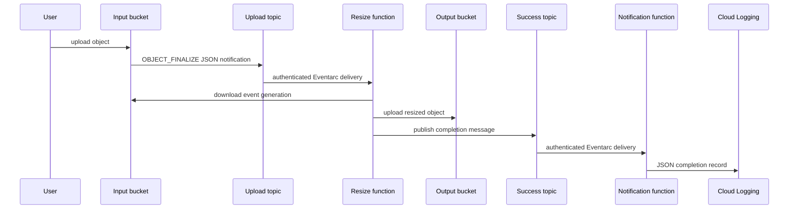

# Architecture

The deployment has two private Cloud Functions Gen2 services and two Pub/Sub
topics. Cloud Storage sends `OBJECT_FINALIZE` notifications to the first topic;
the resize function consumes them through its Eventarc trigger. It writes the
resized object, then publishes a completion message. The notification function
consumes that message and writes one JSON object to stdout, which Cloud Run
captures as structured Cloud Logging data.

## Identity boundaries

| Identity | Purpose | Business permissions |
| --- | --- | --- |
| Resize runtime | Executes image processing | Input object viewer; output object admin; success-topic publisher. |
| Notification runtime | Writes completion log | No application Storage or Pub/Sub role. |
| Resize / notification trigger identities | Invoke their target function | `roles/run.invoker` on the matching Cloud Run service only. |
| Function builder | Builds source archives | Output-source read plus Cloud Build, Artifact Registry, and logging build roles. |
| Cloud Storage service agent | Emits upload notification | Publisher on the upload topic only. |
| Google-managed agents | Operate Functions, Eventarc, and Cloud Build | Created after API enablement; not used as runtime identities. |

The services are authenticated. Never add `allUsers` or
`allAuthenticatedUsers` as an invoker workaround.

## Delivery and consistency boundaries

The function reads the Storage object generation supplied by the event when it
is available. This avoids silently substituting the newest object version for a
specific event, but it does not provide exactly-once processing, ordering, or
guaranteed retention of old generations.

Output upload precedes completion publication. A publish failure can therefore
leave a valid resized object without a completion message. The verifier treats
that as incomplete, rather than calling output existence an end-to-end pass.
Both triggers use `RETRY_POLICY_DO_NOT_RETRY`; Cloud Storage/Pub/Sub delivery
may still duplicate or reorder messages.

## Source artifacts and state

`scripts/package.py` creates deterministic archives under `.build/`. Terraform
uploads them under `_function-source/` in the output bucket using hashes in the
object names. The prefix prevents accidental result-image confusion but is not
an IAM isolation boundary.

Terraform uses local state (`infra/terraform/terraform.tfstate`) to keep the
project easy for one operator. State is ignored by Git: back it up privately,
do not apply from ephemeral CI, and review address moves before any future
reorganization.
