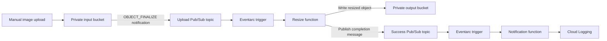

# GCP Serverless Image Processing — Repository Audit and Improvement Plan

**Repository:** `hemanth-yamsani/serverless-image-processing-gcp`  
**Reviewed branch / commit:** `main` / `b3b9c27d5cfde204f594cdd3b9f594f907b887fb`  
**Commit date:** July 19, 2026  
**Audit date:** September 30, 2026  
**Constraint:** Improve correctness, reproducibility, maintainability, documentation and evidence. Do not add application features or new cloud services.

## 1. Verdict

**This is a real implementation of the core happy-path pipeline, not a README-only project. However, the repository does not establish that its current Terraform configuration reproducibly deploys a fully authenticated, independently verified end-to-end pipeline.**

The code implements upload-event decoding, downloading an image, halving its dimensions, uploading the result, publishing a completion message, and consuming that message in a second function. Terraform declares the main resources and connections. The principal shortcomings concern trigger IAM, build reproducibility, logging guarantees, automated verification and overstated documentation.

The most important contrary evidence is in the author's own troubleshooting history: a successful resize was recorded after a manual `allUsers` Cloud Run invoker grant. That is historical evidence of a workaround, not proof that the current deployed service remains public. It also does not prove that the latest Terraform alone reproduces the working configuration.

**Recommended positioning after the improvements are genuinely executed:**

> A reproducibly deployed and verified, event-driven image-resizing pipeline on GCP, with Terraform-managed infrastructure, authenticated triggers and traceable completion logs.

Do not describe it as production-ready, exactly-once, highly available, benchmarked, or guaranteed free unless separate evidence actually establishes those claims.

## 2. What was and was not verified

The tracked tree contains 31 files: 14 Terraform files, two Python source files, two requirements files, three Markdown documents, `.gitignore`, one variable example, two ZIP archives, and six PNG assets.

| Inspection | Result and boundary |
|---|---|
| Tracked code, Terraform, configuration and documentation | Inspected all 23 text files. |
| Deployment ZIPs | Inspected both archives. Their Python and requirements contents match the corresponding source files after CRLF/LF normalization. |
| Image assets | Inventoried six PNG files. Their image contents could not be opened during this audit, so they were not accepted as visually verified execution evidence. |
| GitHub Actions | The repository API returned zero workflow runs. No workflow files were in the reviewed tree. |
| Local Python diagnostics | Ran limited probes with mocked Storage/Pub/Sub clients and an identity replacement for the framework decorator. These were diagnostic checks, not deployed integration tests. |
| Supported-runtime compatibility | Not established. The probe environment was Python 3.13.5 / Pillow 12.3.0, while the project declares Python 3.11 and Pillow below 12. |
| Terraform validation, plan, apply and destroy | Not executed in this audit. |
| Live GCP triggers, logs, IAM and output objects | Not independently inspected or executed. |
| Repository / cloud changes | None made. This document is a plan, not a completed refactor or deployment report. |

The separate diagnostic JSON reports preserve these limits. In particular, passing local mocked checks must not be advertised as proof of a working GCP deployment.

## 3. The existing application contract

Preserve the following behavior:



The output retains the input object name. Each dimension becomes `max(1, original_dimension // 2)`. Thus 1600 × 1000 becomes 800 × 500; 641 × 481 becomes 320 × 240; 1 × 1 remains 1 × 1. This is not a promise of a 50% reduction in encoded file size.

The notification is a log record, not an email or chat message. The current runtime configuration uses two functions, two application buckets and two topics. Eventarc manages its delivery infrastructure. Source ZIP objects also occupy the output bucket.

### Scope boundary

Allowed work: fix IAM and error-handling defects; make packaging deterministic; separate code by responsibility; narrow privileges; add tests and verification scripts; improve the existing logs; remove unused configuration; write accurate documentation; collect actual screenshots and evidence.

Excluded work: new image transformations or size profiles, a frontend, email/Slack/SMS delivery, AI tagging, OCR, a database, a new queue/dead-letter architecture, dashboards, Kubernetes, multiregion deployment, GitOps, or automatic cloud deployment from CI.

Additional service accounts are identity configuration, not new application features. A validation-only GitHub Actions workflow is optional development tooling; the base plan does not depend on it.

## 4. Findings and priorities

Priority P0 means resolve before claiming a reproducible authenticated end-to-end deployment. P1 means resolve before publishing the improved portfolio release. P2 means presentation and maintainability cleanup.

| ID | Priority | Finding | Required action |
|---|---|---|---|
| F01 | P0 | Both function triggers omit an explicit trigger service account. Existing invoker grants target service agents rather than clearly authorizing the actual trigger identity for both services. | Select explicit trigger identities, grant invocation on the correct destination services, and verify authenticated delivery. |
| F02 | P0 | Troubleshooting records a manual public invocation workaround. | Preserve it only as a historical anti-pattern; never use it as the current deployment fix. Inspect the real effective policies in the new deployment. |
| F03 | P0 | Notification code uses `logging.info(json.dumps(...))` without explicit logging setup. | Ensure a visible single-line structured JSON log and verify its actual Cloud Logging representation. |
| F04 | P0 | No automated proof of the complete image-to-notification chain. | Implement and execute a verification script that requires both the resized image and matching notification. |
| F05 | P1 | Terraform deploys committed ZIPs, not the source directories. The ZIPs currently match, but future source edits can silently miss deployment. | Build deterministic packages from source before Terraform planning; stop committing generated ZIPs. |
| F06 | P1 | Shared runtime account has project-wide storage object administration and Pub/Sub publishing. | Separate runtime identities and scope business permissions to the relevant buckets/topic. |
| F07 | P1 | Some agent/IAM creation relies on assumed identities and later propagation sleep. | Order API enablement, service identity creation, IAM and dependent resources correctly. Verify the builder identity. |
| F08 | P1 | Event object generation is ignored. | Bind reads to the event's source generation where available, and document remaining ordering/duplicate limitations. |
| F09 | P1 | Output upload and completion publication are separate operations. | Test and document partial completion. Never treat output existence alone as end-to-end success. |
| F10 | P1 | Terraform lockfile is ignored and Python requirements allow a broad range. | Commit a generated provider lockfile and record/pin a tested Python dependency set. |
| F11 | P1 | No tests or runtime-compatible integration checks. | Add unit, real-framework contract and live smoke checks for existing behavior. |
| F12 | P2 | Unused `notification_email`; an explicitly created pull subscription has no consumer in the repository. | Remove unused configuration after confirming it is not a deliberate external diagnostic dependency. |
| F13 | P2 | README/SETUP duplicate material and reference missing `BUGFIX_LOG.md`; directory examples drift from reality. | Consolidate docs, correct links, use the actual repository layout. |
| F14 | P2 | MIT badge has no matching LICENSE file in the tree. | Reconcile the licensing statement with actual upstream permission; retain attribution. Do not invent an MIT grant. |
| F15 | P2 | Cleanup documentation omits destructive bucket settings, retained APIs and possible managed build artifacts. | Document exact deletion boundaries and perform targeted post-cleanup inventory checks. |

### 4.1 Trigger identity is different from runtime identity

The runtime service account determines what the Python code may access. The trigger identity determines who may invoke the function's underlying Cloud Run service. Google-managed service agents are a third category and should not be confused with either.

The Google Cloud Functions v2 API documents that an omitted `event_trigger.service_account_email` defaults to the Compute Engine default service account. The reviewed Terraform instead grants invoker access to the Eventarc service agent on the resize service and grants the Pub/Sub service agent project-wide invocation rights. The notifier has no equivalent explicit target-service binding for the actual trigger principal.

That mismatch is a fresh-project deployment/delivery risk. Existing inherited permissions or manual changes can conceal it. It is not evidence that every possible deployment of this repository must fail.

For this project's direct Pub/Sub event triggers, do not blindly add `roles/eventarc.eventReceiver`: Google's Eventarc documentation exempts direct Pub/Sub events from that requirement. Apply only permissions justified for the selected delivery topology.

### 4.2 Logging needs an explicit contract

Python's default root logging threshold is WARNING. Whether the deployed framework configures logging differently must be observed, not assumed. A JSON string passed to an unconfigured INFO logger does not by itself prove that a visible `jsonPayload` notification will exist.

Use a deliberately configured JSON logger or a single JSON object per stdout line. For this small project, JSON stdout is adequate and uses existing Cloud Run log collection; no new logging service or direct Logging client dependency is required.

Retain `event`, `bucket`, `object`, `status` and `message`. Add correlation information such as source generation or event ID where needed to establish which upload completed. Treat those as evidence/diagnostic fields, not new user-facing notification features. Do not log credentials or full authentication payloads.

### 4.3 Partial completion is a real boundary

The source code uploads the output before calling `publisher_client.publish(...).result()`. If publishing fails, the output object can already exist. Limited offline fault injection reproduced that condition with mocked clients.

Therefore the end-to-end pass condition must include a matching notification consumed by the second function. Do not introduce a database or claim atomicity to conceal this boundary.

Both Terraform triggers explicitly use `RETRY_POLICY_DO_NOT_RETRY`. Preserve that baseline for this scoped revision and document it. Turning on retries without reasoning about duplicates and partially completed work is not a free reliability improvement. Cloud Storage/Pub/Sub notifications can be duplicated or delivered out of order even when application-failure retries are disabled.

### 4.4 Temporary paths and generations

Current temporary files depend on the input basename, not a unique invocation directory. Replace that with a `TemporaryDirectory` and reliable cleanup. Do not claim a proven concurrent collision in the reviewed deployment: the function API's documented default concurrency is one, and actual runtime concurrency was not inspected.

The handler downloads the current object by name rather than the generation in the event. Bind the download to the event generation and test it. Handle an unavailable old generation as an explicit failure; generation-aware reads do not imply that previous versions are retained. This alone does not solve all duplicate messages, stale output overwrites, or event ordering. State those limits rather than advertising exact-once processing.

## 5. Target repository layout

Use one understandable Terraform root. Splitting every resource into a reusable module would add ceremony without demonstrating reuse.

```text
.
├── README.md
├── .gitignore
├── .gitattributes
├── pyproject.toml
├── requirements-dev.txt
├── functions/
│   ├── resize/
│   │   ├── main.py
│   │   ├── events.py
│   │   ├── processing.py
│   │   └── requirements.txt
│   └── notification/
│       ├── main.py
│       └── requirements.txt
├── infra/
│   └── terraform/
│       ├── versions.tf
│       ├── providers.tf
│       ├── backend.tf
│       ├── apis.tf
│       ├── variables.tf
│       ├── locals.tf
│       ├── storage.tf
│       ├── messaging.tf
│       ├── functions.tf
│       ├── iam.tf
│       ├── service-agents.tf
│       ├── propagation.tf
│       ├── outputs.tf
│       ├── terraform.tfvars.example
│       └── .terraform.lock.hcl
├── scripts/
│   ├── package.py
│   └── verify.py
├── tests/
│   ├── unit/
│   ├── contract/
│   └── fixtures/
├── docs/
│   ├── architecture.md
│   ├── deployment.md
│   ├── verification.md
│   ├── troubleshooting.md
│   ├── decisions.md
│   ├── assets/
│   └── evidence/
│       ├── README.md
│       ├── screenshots/
│       └── results/
├── .build/                       # generated; ignored
└── .local/evidence/               # raw/private; ignored
```

A real LICENSE file belongs at root only when the licensing terms are established. `.github/workflows/validate.yml` may be added as optional validation-only tooling. Neither a license badge nor a workflow badge should claim something that does not exist.

### Old-to-new migration map

| Current files | Destination / modification |
|---|---|
| `src/main.py` | `functions/resize/main.py`; move event parsing to `events.py`, image transformation to `processing.py`. |
| `src-notification/main.py` | `functions/notification/main.py`; retain its small scope. |
| Both `requirements.txt` files | Beside their respective functions; use tested dependency resolution. |
| `CreateThumbnail.zip`, `CreateNotification.zip` | Remove from version control after automatic packaging works; generated under `.build/`. |
| `gcs-buckets.tf` | `infra/terraform/storage.tf`. |
| `pubsub.tf` | `infra/terraform/messaging.tf`; remove the unused manual subscription only after checking intended use. |
| `cloud-function.tf`, `notification-function.tf` | `infra/terraform/functions.tf`; update package paths and explicit trigger identities. |
| `iam-service-account.tf`, `iam-policy-bindings.tf` | `infra/terraform/iam.tf`; clearly group runtime and trigger permissions. |
| `service-agent-iam.tf` | `infra/terraform/service-agents.tf`; distinguish managed agents from build/runtime/trigger accounts. |
| `time-delay.tf` | `propagation.tf` only if a documented delay remains necessary after fixing dependency ordering. |
| Other Terraform files | Move into the Terraform root without gratuitously renaming resource addresses. Split version constraints from provider configuration. |
| `SETUP.md` | `docs/deployment.md`, removing duplicated overview/marketing material. |
| `TROUBLESHOOTING.md` | Current fixes in `docs/troubleshooting.md`; historical migration lessons in `docs/decisions.md`. |
| Existing PNG files | Keep clearly attributed upstream references or replace with original diagrams and new deployment evidence. Never relabel upstream screenshots as your own run. |

### State safety during reorganisation

A directory move is not permission to lose local state. The existing backend is local and points to `terraform.tfstate`. Before moving the Terraform root, identify the actual state and back it up privately. Preserve resource addresses where possible. If addresses change, use deliberate state migration / `moved` blocks and review the resulting plan.

Do not initialise an empty state in the new folder and apply against an existing deployment. A cosmetic refactor should not unexpectedly replace the buckets or duplicate the live resources. A fresh deployment in a separate disposable project is a different, explicitly documented path.

## 6. Implementation work packages

### WP1 — Make source the single source of truth

Implement `scripts/package.py` using standard Python ZIP tooling. It should:

1. Package the two function directories independently with `main.py` and `requirements.txt` at ZIP root, including the resizer's local helper modules.
2. Use a sorted file list, stable timestamps and an explicit allowlist for deterministic output.
3. Exclude virtual environments, caches, state, local config and credentials.
4. Write `.build/resize.zip` and `.build/notification.zip` plus a manifest containing source commit and SHA-256 hashes.
5. Fail clearly if entrypoints or requirements are absent.

Update Terraform to consume those generated packages using paths anchored to `path.module`, not an assumed caller working directory. Use content-derived object names so a source change produces a new source object reference and function build.

The mandatory ordering is **package before plan**, because file hashing requires the ZIPs to exist. Two packaging runs with identical inputs must produce identical archive hashes. A source edit must change the correct archive hash and lead to an expected code update in the plan. Routine source deployment must not require `terraform taint`.

Keep source objects in a reserved prefix of the existing output bucket, such as `_function-source/`, rather than adding another cloud bucket. Document that prefix, prevent input/output object names from colliding with it, and keep it out of image-result screenshots. A prefix is not an access-control boundary: use appropriate object-prefix IAM conditions where supported and tested, or explicitly document that the shared output bucket does not isolate source artifacts from an account with bucket-wide object access. Do not advertise source-artifact isolation merely because the files are in a separate prefix.

### WP2 — Correct IAM without public invocation

Use the following target business-permission matrix:

| Principal | Needed access | Scope |
|---|---|---|
| Resize runtime account | Read source objects | Input bucket only. |
| Resize runtime account | Write/replace output objects according to existing overwrite behavior | Output bucket only. Use an appropriate object role; object-creator alone is insufficient when replacing existing objects. |
| Resize runtime account | Publish completion | Success topic only. |
| Notification runtime account | No input/output storage access and no application topic publishing | Emit logs through stdout; do not grant unrelated business permissions. |
| Trigger identity or identities | Invoke the target function service | Each actual destination Cloud Run service. |
| Cloud Storage service agent | Publish finalize notifications | Upload topic only. |
| Build identity | Read packaged source, write the build artifact and build logs | The actual selected build resources and documented build requirements. |

Set the trigger identities explicitly in both `event_trigger` blocks. Grant invocation to those same identities on the corresponding services, preferably using resource references rather than hardcoded service-name strings.

Determine and configure the actual build service account rather than assuming the Compute default account is always the builder. Preserve required Google-managed service-agent roles; removing legitimate managed-agent permissions indiscriminately can break deployment.

Bootstrap order must be clear: enabled API → materialised service identity → role binding → dependent deployment or notification. A sleep after failing IAM operations does not fix their missing dependencies.

Acceptance requires successful authenticated delivery AND review of the effective policies. Do not rely solely on a role-binding screenshot. No `allUsers` or `allAuthenticatedUsers` invoker workaround, no disabled invoker check, and no unnecessary project-wide invocation grant should be needed.

### WP3 — Refactor small responsibilities and error handling

Keep the CloudEvent entrypoint named `handler`. In the resizer:

- Validate event shape and required fields, Base64/UTF-8/JSON decoding, and required configuration before side effects.
- Preserve the existing supported input behavior. The direct Storage-event fallback may remain if documented and tested; the provisioned path is Pub/Sub through Eventarc.
- Separate decoding from the Pillow transformation and side-effect orchestration.
- Download the event's source generation when available; include generation in evidence.
- Use per-invocation temporary directories with cleanup on success and failure.
- Keep image dimensions and naming behavior unchanged.
- Wait for completion publication before recording processing success; use a bounded publish wait within the function's execution budget.
- Emit structured diagnostic records at meaningful boundaries without adding a monitoring product.
- Define failure semantics using actual Functions Framework contract tests. Do not assume an HTTP-looking return tuple from a CloudEvent handler controls acknowledgement or retry behavior.

For notification processing, validate required fields, emit the completion record explicitly, and report malformed payloads clearly. Keep it small; it does not need an abstract notification platform or provider integrations.

Do not silently claim new format support. Start live verification with JPEG and PNG because those are the concrete fixtures in the test plan. Treat animated images, unusual image modes and very large images as unsupported/unverified unless separately tested within the same existing feature scope.

### WP4 — Pin and document the tested toolchain

Use Python 3.11 for the compatibility gate. Generate and commit a tested dependency resolution for each function, consistent with the declared runtime. Record the actual installed versions in the verification report.

Stop ignoring `.terraform.lock.hcl`; generate it through Terraform and commit it. Keep provider upgrades deliberate. Align documentation with the existing Terraform minimum of 1.6.0, not the README's current 1.0 claim. Set normal source line endings through `.gitattributes` to remove needless archive differences.

Add development-only test/lint dependencies without mixing them into the function deployment packages. Ignore `.venv`, `.build`, caches, private evidence, local variables, credentials, Terraform state and saved plan files. Do not ignore the provider lockfile.

### WP5 — Simplify unused configuration and outputs

Remove the unused email variable and its example value. Verify that no real consumer needs the manually declared upload-topic pull subscription before removing it. It is not the subscription configured by the managed Eventarc trigger, and its existence does not prove event delivery.

Add outputs for existing resources needed by verification: project/region, both bucket names, both function names, both topic identifiers and relevant trigger/runtime identities. These are discoverability improvements, not additional product capabilities.

Retain local state for the base single-operator project. Document backup and ownership. Do not bolt on automatic Terraform apply from an ephemeral CI runner using local state.

## 7. Test plan for the existing feature

### Unit and framework-contract matrix

| Case | Required assertion |
|---|---|
| JPEG 1600 × 1000 | Output decodes and is 800 × 500. |
| PNG 641 × 481 | Output decodes and is 320 × 240. |
| PNG 1 × 1 | Dimensions never become zero. |
| Valid Pub/Sub envelope | Bucket, object and generation are decoded correctly. |
| Existing direct-event fallback | Remains correct if retained. |
| Invalid Base64, UTF-8, JSON, missing fields | Controlled rejection/error; no false success notification. |
| Non-image data | No valid resized output and no success notification. |
| Download failure | No upload or success notification; temporary files cleaned. |
| Resize failure | No success notification; temporary files cleaned. |
| Upload failure | No success notification. |
| Publish failure after upload | Partial completion is exposed; the test does not falsely assert that the output is absent. |
| Success path | Upload succeeds before completion is published; publish future is awaited. |
| Notification payload | Required fields and structured JSON output are verified. |
| Temporary-file cleanup | Runs on both success and failure. |
| Event generation | The requested source generation reaches the storage client call. |
| Packaging | Required files are at root, hashes repeat, secrets/dev artifacts excluded. |
| Actual Functions Framework | A realistic CloudEvent request reaches the real handler under supported dependencies. |

Mocked unit tests validate application logic, not cloud permissions. Terraform validation checks configuration shape, not whether IAM lets events invoke a function. Framework tests check the entrypoint contract, not live Eventarc delivery. Keep these categories separate in the report.

### Live verifier specification

Implement `scripts/verify.py` as an opt-in tool that reads Terraform outputs and uses a unique object name per run. It must not change cloud IAM or repair a deployment silently.

A successful run should:

1. Record source commit, UTC start time, project alias, region, tested runtime/dependencies and package hashes.
2. Choose an object key such as `demo/<run-id>/sample-landscape.jpg` and confirm no pre-existing output can satisfy the test accidentally.
3. Inspect the input image locally and record its dimensions and checksum.
4. Upload it and record the resulting source generation.
5. Poll for the output with a bounded timeout, rather than assuming immediate delivery.
6. Download and decode the output; verify expected dimensions and matching object key.
7. Wait for the notification function's actual completion log for that same object and correlation information.
8. Mark success only when both the image assertion and notification assertion pass.
9. Write machine-readable results and a short human-readable summary.
10. Leave enough information to correlate screenshots without exposing credentials or raw Terraform state.

A timeout is a failed or incomplete verification, not a reason to generate an assumed-success screenshot. Google Cloud Storage notifications do not provide a fixed delivery-time SLA, so choose a practical test deadline and record what happened rather than claiming a platform guarantee.

Run the three image fixtures. Run one invalid-input case and verify the error evidence plus absence of a matching SUCCESS within the observation window. Review unrelated logs separately so they cannot satisfy the case.

After deployment, run a second Terraform plan and record a no-change result. Use `-detailed-exitcode`: 0 means no changes, 2 means a diff, and 1 means an error. A no-op plan is evidence of alignment for Terraform-managed state, not proof that every undeclared cloud policy or resource is absent.

### Proposed command interface

The two Python scripts below do not exist upstream; these are implementation targets, not commands to paste into the original repository today.

```bash
# From the reorganised repository root; use a Python 3.11 virtual environment.
python -m pytest tests/unit tests/contract
python scripts/package.py
terraform -chdir=infra/terraform init
terraform -chdir=infra/terraform fmt -check
terraform -chdir=infra/terraform validate
terraform -chdir=infra/terraform plan
terraform -chdir=infra/terraform apply
python scripts/verify.py --terraform-dir infra/terraform --output .local/evidence/current
terraform -chdir=infra/terraform plan -detailed-exitcode
```

The verification tool must surface errors and use an explicit timeout. Make local authentication and billing prerequisites part of the deployment runbook, not hidden assumptions inside the script.

## 8. Documentation plan

### README.md — the portfolio front page

Aim for a compact overview, approximately 120–180 lines rather than multiple repeated tutorials. Use this order:

1. Specific title and a one-sentence behavior summary.
2. One genuine before/after image, labelled with measured dimensions.
3. One accurate architecture diagram.
4. A small “What is verified” table with links to the latest real evidence.
5. A short quickstart linking to the full deployment runbook.
6. Concise technical decisions: identity boundaries, separate completion stage, deterministic packages.
7. Known limitations and cleanup warning.
8. Documentation links and upstream attribution/licensing information.

Remove the future-feature wishlist and unsupported production/free-tier claims. Use actual status badges only. Keep marketing proportional to the proof.

**Suggested repository description:**

> Terraform-managed GCP pipeline that resizes uploaded images and records completion through Pub/Sub-triggered functions.

**Suggested title:**

> GCP Event-Driven Image Resizing — Terraform Deployment and End-to-End Verification

These are presentation suggestions, not claims that verification has already been completed.

### docs/architecture.md

Explain the actual two-hop Eventarc/Pub/Sub flow, the unchanged image contract and the distinction between runtime, trigger, build and managed service-agent identities. Mark which resources are explicitly declared and which are platform-managed. Mention the reserved source-archive prefix in the output bucket.

Include a sequence diagram showing that output upload happens before completion publication. Explain the partial-success boundary, duplicate/out-of-order delivery, no-retry setting and local-state choice. Do not show an email integration or alternative direct-GCS path as the provisioned architecture.

### docs/deployment.md

Cover project/billing prerequisites, the actual supported toolchain, normal `gcloud` authentication versus Application Default Credentials, variable configuration, package-first ordering, Terraform initialization/validation/reviewed plan/apply, and reading outputs.

List deployer prerequisites separately from runtime permissions. Include first-deployment API/agent propagation considerations. Provide one canonical Python-based workflow usable without a Unix-only ZIP utility. Avoid copying platform installation manuals into the project.

### docs/verification.md

Define pass/fail criteria, supported fixtures, actual commands, expected versus observed outputs, test deadlines, correlation fields and evidence locations. Separate example log payloads from captured log records. Include how to run the invalid-input case, no-op plan and authenticated-invocation check.

### docs/troubleshooting.md

Use a table or short sections: symptom → likely cause → diagnostic check → verified fix. Cover missing API/agent permissions, wrong trigger principal, wrong package root, stale packages, missing logs, publish failure and lost local state.

Use current resource addresses and names. Do not prescribe opening invocation to everyone or blindly tainting resources. Where a historical statement about IAM inheritance or Cloud Run revisions is inaccurate, replace it with a diagnosis of the actual principal/resource/policy rather than repeating the generalisation.

### docs/decisions.md

Preserve useful migration history and upstream credit, clearly labelled as history rather than current deployment instructions. Explain why the design uses two functions, two topics, private buckets, a flat Terraform root and local state. State why exactly-once delivery and automatic replay are not claimed.

Separate the author's original historical experience from the changes and tests you personally perform.

### docs/evidence/README.md

Index each published run with commit, date, region, package hash reference, fixture results, screenshots and limitations. Link evidence to the code it actually tested, even if the later documentation commit differs. Never update the “tested commit” merely because a screenshot was added in a later commit.

## 9. Screenshot capture plan

Take new screenshots only after the relevant test or deployment operation really succeeds. The existing six assets are not a substitute for your own execution evidence.

Use the same run ID, same project, same object key and consistent timestamps across the happy-path set. For the main case use `demo/<run-id>/sample-landscape.jpg`, originally 1600 × 1000, expecting 800 × 500.

| ID / suggested filename | Where and when to capture | What must be visible | What it establishes |
|---|---|---|---|
| SS-01 `01-local-validation.png` | Terminal after supported-runtime tests and packaging | Python version, test summary, package manifest/hash summary | Local validation and package provenance; not cloud delivery. |
| SS-02 `02-terraform-plan.png` | Terminal before apply | Reviewed plan summary and intended project/region context | Intended infrastructure changes. |
| SS-03 `03-terraform-apply.png` | Terminal after successful apply | Completion summary and both function/bucket outputs | Terraform deployment completion, not application correctness. |
| SS-04 `04-functions-ready.png` | Cloud Run functions/services list after deploy | Both actual functions, ready state and matching region | Both deployed targets exist. |
| SS-05A `05a-upload-trigger.png` | Eventarc upload trigger details | Upload topic, destination resizer, trigger identity and active status | First routing configuration. |
| SS-05B `05b-success-trigger.png` | Eventarc success trigger details | Success topic, destination notifier, trigger identity and active status | Second routing configuration. |
| SS-06 `06-access-controls.png` | Bucket/function permissions after policy verification | Private bucket setting and/or correctly scoped trigger/runtime binding; use separate images if unreadable | Relevant access configuration, supported by exported effective-policy checks. |
| SS-07 `07-input-object.png` | Input bucket object details immediately after test upload | Unique object key, generation, creation time | Exact input for this run. |
| SS-08 `08-resize-execution.png` | Resizer logs filtered to the test object | Correlation information and real resize/upload/publish completion records | The resizer executed the intended stages. |
| SS-09 `09-output-object.png` | Output bucket object details after verifier finds it | Same object key, object metadata and timestamp; no source ZIP passed off as output | Output object exists for this run. |
| SS-10 `10-before-after.png` | Genuine input and downloaded output displayed with inspection results | Original/resized image and measured 1600 × 1000 → 800 × 500 dimensions | The image transformation actually happened. |
| SS-11 `11-notification-json.png` | Notifier Logs Explorer record expanded | Actual `jsonPayload`, `IMAGE_RESIZE_NOTIFICATION`, same object, SUCCESS and correlation fields | The downstream consumer processed completion. |
| SS-12 `12-end-to-end-verification.png` | Terminal after verifier finishes | Per-case image AND notification assertions, run ID, timestamp, overall result | Script-checked end-to-end result. |
| SS-13 `13-invalid-input.png` | Terminal/logs after negative test | Expected error and verifier assertions that no matching success occurred | Failure handling does not falsely report success. |
| SS-14 `14-no-change-plan.png` | Second Terraform plan | No-change result and exit-code interpretation | Repeated plan alignment for managed resources. |
| SS-15 `15-cleanup.png` | Terminal after approved teardown and inventory | Destroy result plus checks of project-specific remaining resources | Cleanup was checked rather than assumed. |

Optional: a real green validation-only Actions run, a source-change/redeploy proof, and separate readable access-control images for each important policy. Do not create an Actions screenshot or badge when no workflow was executed.

### Evidence pairs

Screenshots should have supporting records, not merely attractive console pages. Useful pairs include:

| Screenshot group | Companion record |
|---|---|
| Local tests and packages | `unit-results.txt`, `runtime-versions.txt`, `package-manifest.json`. |
| Deployment and triggers | Sanitised output JSON and selected trigger configuration exports. |
| Input/output and before-after | Object metadata, source generation, decoded dimensions and checksums. |
| Resizer/notifier logs | Selected JSON log entries for this object/run. |
| End-to-end summary | `verification.json` with independent image/notification assertions. |
| No-change plan | Text output and recorded exit code. |
| Cleanup | Project-scoped resource inventory results and known retained resources. |

Keep raw material under `.local/evidence/<run-id>/` while working. Publish only curated, sanitised screenshots and records under `docs/evidence/`. Never commit state, saved binary plans, credentials, tokens, signed URLs, personal billing details or full raw IAM/account dumps without review.

### Presentation rules

Use a consistent readable capture size, crop unrelated desktop/browser clutter, and make text large enough to inspect. Redact personal identifiers consistently without hiding the object names, timestamps, statuses and relationships needed to understand the proof. Project IDs are identifiers rather than passwords, but may still be redacted for privacy.

Every caption should answer: what action produced this, what assertion does it support, and what does it not prove? For example:

> SS-11 — Completion log for `demo/<run-id>/sample-landscape.jpg`. Confirms downstream notification consumption for the same object checked by the image verifier. It does not demonstrate exactly-once processing.

Use at most a few headline visuals in the README: the architecture, before/after image, expanded notification, and verification summary. Put the complete gallery in the evidence index. Architecture drawings illustrate the design; they are not execution screenshots.

Never fabricate log lines, paint success status over a failure, mix unrelated deployments into one run, or claim the upstream author's screenshots as personal work.

## 10. Cleanup and cost boundaries

Both existing buckets use `force_destroy = true`. Teardown can delete original images, resized images and packaged source objects. Export the evidence first and make that destructive behavior prominent in the runbook. For a non-disposable deployment, change the setting only as an explicit configuration decision.

Terraform intentionally leaves enabled APIs on destroy. Function builds can also involve platform-managed source/build/artifact resources. Inspect leftovers and ownership before deleting anything; do not blanket-delete shared project resources. Cloud retention or soft-deletion behavior can affect what remains after logical deletion and should be recorded for the actual project.

Do not promise free operation. Document the chosen region, small test workload, instance bounds and teardown procedure. Report measured billing data only when available, with its observation window and reporting limitations. A cleanup screenshot does not prove the bill is zero.

## 11. Optional validation-only GitHub Actions

This is development automation, not a new runtime feature. It may run:

- Python 3.11 tests and lint checks.
- Package generation and package-content assertions.
- Terraform formatting and `init -backend=false` / validation.
- Documentation link checks.

Use no GCP credentials for the basic validation job. Pin actions and tool versions deliberately. Generate the function packages before Terraform validation if configuration evaluation depends on archive files.

Do not add auto-apply or auto-destroy. The local Terraform backend is not suitable for casual deployment from disposable CI runners. Only show a passing workflow badge after the real job has run successfully on the code being presented.

## 12. Ordered execution and commit plan

| Phase | Work | Exit gate | Suggested commit |
|---|---|---|---|
| A — Baseline | Fork/branch with attribution; record upstream commit; inventory files; identify any existing local state/deployment; freeze feature scope. | Known baseline and state safety documented. | `docs: record upstream baseline and audit scope` |
| B — Reorganise and package | Move code/Terraform/docs safely; implement deterministic packaging and update package paths; preserve resource addresses. | Source edits reliably change deployment packages; no accidental bucket replacement. | `refactor: organise source and build reproducible function packages` |
| C — Delivery and permissions | Explicit trigger/build identities, scoped runtime roles, service-agent dependencies, visible structured logs, remove public workaround from active instructions. | Code/configuration review shows correct principals and log contract. | `fix: authenticate event delivery and scope runtime access` |
| D — Correctness and tests | Small code refactor, generation-aware reads, cleanup, tested requirements, provider lock, unit/contract tests and live verifier. | Supported-runtime local checks pass with no unexplained failures. | `test: verify image processing and completion semantics` |
| E — Fresh deployment | Deploy in the selected authorised project; inspect policies; execute all positive and negative cases; verify downstream logs; run no-op plan. | Both image and notification pass for the same fresh test objects. | `docs: record deployment verification results` |
| F — Evidence and docs | Capture the agreed screenshots during actual operations; publish sanitised results; finish README and runbooks; remove broken links and stale claims. | Every headline claim has matching current evidence. | `docs: publish reproducible runbook and execution evidence` |
| G — Final review and cleanup | Review attribution/licensing, verify no sensitive files; perform approved teardown and record leftovers; tag only after acceptance. | Clean repository, accurate limitations, verified release tied to a code commit. | `docs: finalise verified release and cleanup record` |

Capture evidence as the operations happen in phase E; phase F curates and explains it. Do not destroy the deployment before the required screenshots and exports are collected. A later documentation-only commit may refer back to the tested code commit rather than pretending the entire cloud deployment was rerun.

## 13. Final acceptance checklist

- [ ] The functional scope is unchanged: upload → half-dimension image → completion log.
- [ ] Both function source packages are generated deterministically from the tracked source.
- [ ] The supported runtime and exact tested dependency versions are recorded.
- [ ] Terraform provider lockfile is committed.
- [ ] Actual trigger principals are explicitly configured and authorised on both targets.
- [ ] No public invoker workaround or unnecessary project-wide runtime permissions are required.
- [ ] First-deployment API/service-agent/IAM dependencies are correct.
- [ ] Unit and actual-framework contract tests pass.
- [ ] Live JPEG, odd-dimension PNG and tiny-image cases pass image and notification checks.
- [ ] Invalid input does not produce a false SUCCESS.
- [ ] Publish failure is documented as possible partial completion rather than hidden.
- [ ] Generation, duplicate, retry and ordering limitations are stated honestly.
- [ ] A second plan reports no unexpected managed-resource changes.
- [ ] A source-change test demonstrates package/function update without unnecessary data-resource replacement.
- [ ] Screenshots and machine-readable records refer to matching runs and tested commits.
- [ ] README links, paths, versions, badges and licensing statements match reality.
- [ ] Upstream attribution is retained and personal work is distinguished from inherited work.
- [ ] Raw secrets, credentials, state, binary plans and private evidence are excluded.
- [ ] Teardown behavior and remaining resources are verified and documented.

**Only after those gates pass should the README say “deployed and verified end to end.”**

## 14. Audit provenance and primary sources

Repository references below are pinned to the reviewed commit. Recommendations in this document are proposed work, not statements that the upstream repository already implements them.

- [Complete reviewed repository](https://github.com/hemanth-yamsani/serverless-image-processing-gcp/tree/b3b9c27d5cfde204f594cdd3b9f594f907b887fb)
- [Resize implementation](https://github.com/hemanth-yamsani/serverless-image-processing-gcp/blob/b3b9c27d5cfde204f594cdd3b9f594f907b887fb/src/main.py)
- [Notification implementation](https://github.com/hemanth-yamsani/serverless-image-processing-gcp/blob/b3b9c27d5cfde204f594cdd3b9f594f907b887fb/src-notification/main.py)
- [Resizer deployment](https://github.com/hemanth-yamsani/serverless-image-processing-gcp/blob/b3b9c27d5cfde204f594cdd3b9f594f907b887fb/cloud-function.tf)
- [Notifier deployment](https://github.com/hemanth-yamsani/serverless-image-processing-gcp/blob/b3b9c27d5cfde204f594cdd3b9f594f907b887fb/notification-function.tf)
- [Runtime IAM](https://github.com/hemanth-yamsani/serverless-image-processing-gcp/blob/b3b9c27d5cfde204f594cdd3b9f594f907b887fb/iam-policy-bindings.tf)
- [Service-agent and invocation IAM](https://github.com/hemanth-yamsani/serverless-image-processing-gcp/blob/b3b9c27d5cfde204f594cdd3b9f594f907b887fb/service-agent-iam.tf)
- [Historical troubleshooting, including public-invocation workaround](https://github.com/hemanth-yamsani/serverless-image-processing-gcp/blob/b3b9c27d5cfde204f594cdd3b9f594f907b887fb/TROUBLESHOOTING.md)
- [Storage configuration](https://github.com/hemanth-yamsani/serverless-image-processing-gcp/blob/b3b9c27d5cfde204f594cdd3b9f594f907b887fb/gcs-buckets.tf)
- [Messaging configuration](https://github.com/hemanth-yamsani/serverless-image-processing-gcp/blob/b3b9c27d5cfde204f594cdd3b9f594f907b887fb/pubsub.tf)
- [Git ignore rules](https://github.com/hemanth-yamsani/serverless-image-processing-gcp/blob/b3b9c27d5cfde204f594cdd3b9f594f907b887fb/.gitignore)
- [Cloud Functions v2 API: EventTrigger service account and service configuration](https://docs.cloud.google.com/functions/docs/reference/rest/v2/projects.locations.functions)
- [Eventarc trigger identity permissions and direct Pub/Sub exception](https://docs.cloud.google.com/eventarc/docs/roles-permissions)
- [Cloud Run structured logging](https://docs.cloud.google.com/run/docs/logging)
- [Cloud Storage notifications: delivery guarantees, ordering and generations](https://docs.cloud.google.com/storage/docs/pubsub-notifications)
- [Terraform dependency lockfile](https://developer.hashicorp.com/terraform/language/files/dependency-lock)
- [Python logging HOWTO](https://docs.python.org/3/howto/logging.html)

### Supplemental offline results

The archive report confirms four source-file matches across two archives, after newline normalization. Offline diagnostics observed ordinary resize behavior, invalid-image rejection, output-before-publish partial completion, and INFO suppression with an unconfigured WARNING root logger.

Those diagnostics used Python 3.13.5 and Pillow 12.3.0 with mocked cloud clients and an identity framework decorator. They are not compatibility tests for the declared production runtime and not evidence that GCP was deployed. Re-run the full acceptance matrix under Python 3.11 and the locked project dependencies before making a release claim.
